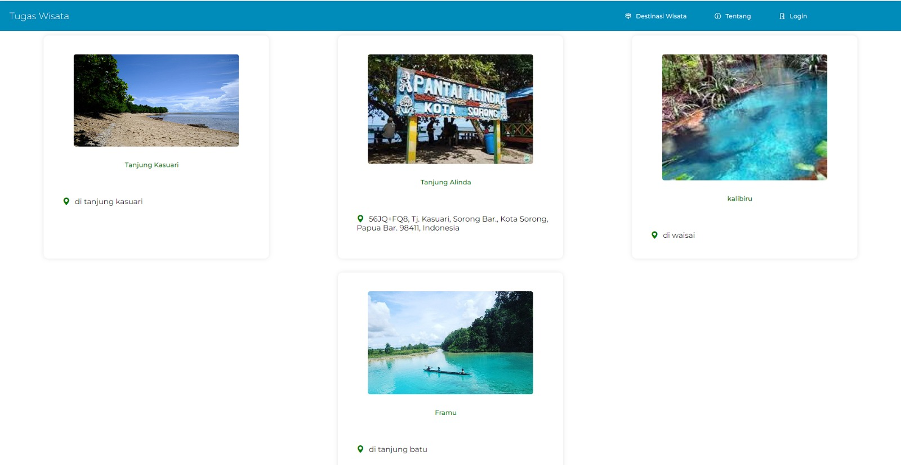
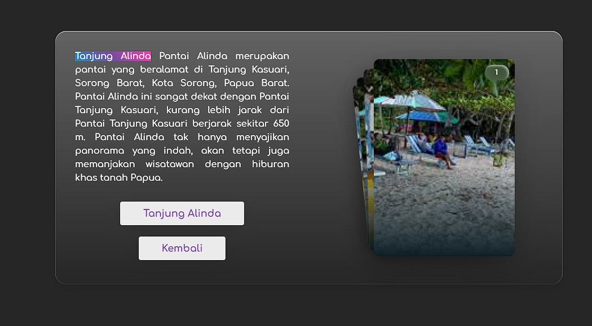

# Aplikasi Informasi Wisata

Aplikasi Informasi Wisata adalah aplikasi sederhana berbasis web untuk menampilkan informasi tentang tempat-tempat wisata. Aplikasi ini memungkinkan pengguna untuk mengetahui destinasi wisata, deskripsi singkat, dan melihat gambar dari tempat tersebut.

## Fitur

- **Halaman Beranda:**
  - Menampilkan daftar destinasi wisata yang populer.
  - Setiap destinasi menampilkan gambar, nama, dan deskripsi singkat.

- **Detail Destinasi:**
  - Halaman terperinci untuk setiap destinasi dengan informasi lebih lanjut, alamat, dan galeri gambar.

- **Galeri Gambar:**
  - Tampilkan gambar-gambar menarik dari destinasi wisata.




## Instalasi

1. Clone repositori ini ke dalam direktori web server Anda.

    ```bash
    git clone https://github.com/arfianaja/Tugas_Wisata.git
    ```

2. Buka aplikasi pada browser dan mulai menjelajahi destinasi wisata!

## Penggunaan

1. Akses aplikasi melalui browser.

2. Pilih destinasi wisata yang ingin Anda ketahui lebih lanjut.

3. Lihat informasi rinci dan gambar-gambar menarik dari destinasi tersebut.
